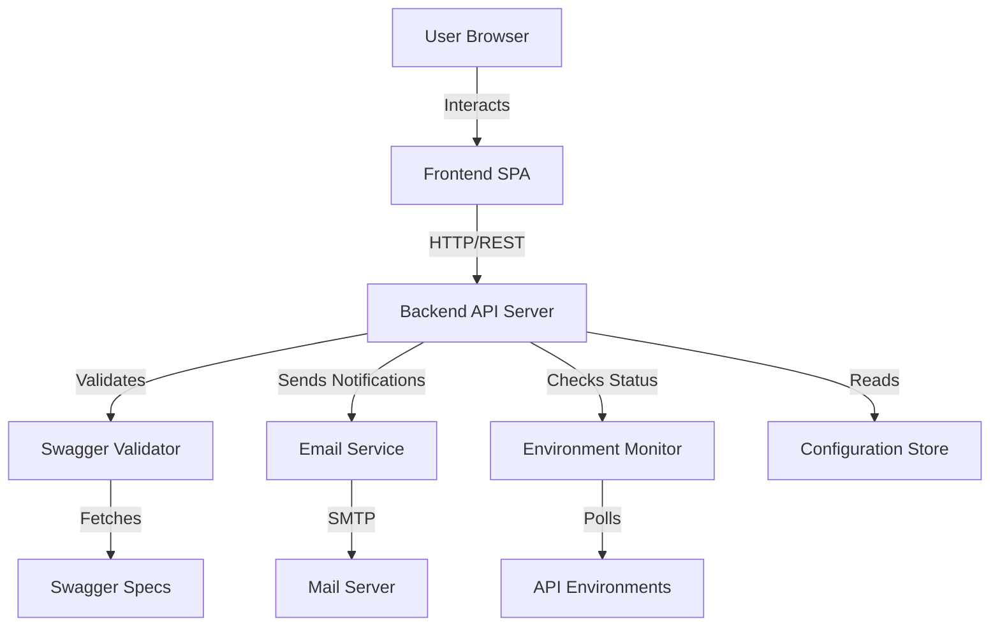

# Design Document: API Error Logger

## Overview

The API Error Logger is a full-stack web application that provides a user-friendly interface for reporting API errors, validates those errors against OpenAPI/Swagger specifications, and notifies the investigation team of legitimate issues. The system consists of a frontend web interface, a backend API server, a validation engine, an email notification service, and an environment monitoring component.

The architecture follows a client-server model with clear separation of concerns:
- **Frontend**: Interactive single-page application (SPA) for user interaction
- **Backend API**: RESTful service handling error submissions, validation orchestration, and environment monitoring
- **Validation Engine**: Component that validates requests against OpenAPI specifications
- **Notification Service**: Email delivery system for investigation team alerts
- **Environment Monitor**: Service that checks API environment availability

## Architecture

### System Architecture



### Technology Stack

**Frontend:**
- HTML5/CSS3 for structure and styling
- JavaScript (ES6+) for interactivity
- Fetch API for HTTP requests
- No heavy frameworks required (vanilla JS or lightweight library)

**Backend:**
- Node.js with Express.js (lightweight, no Java build tools)
- OpenAPI validation library (e.g., openapi-request-validator, swagger-parser)
- Nodemailer for email delivery
- Node-cron or similar for scheduled environment checks

**Configuration:**
- JSON or YAML configuration files
- Environment variables for sensitive data (email credentials, etc.)

**Deployment:**
- Can run on any Node.js hosting platform
- No Java build tools (Maven, Gradle) required

## Components and Interfaces

### 1. Frontend Web Interface

**Responsibilities:**
- Render error submission form
- Display environment status dashboard
- Show validation results and feedback
- Handle user interactions
- Auto-refresh environment status

**Key Functions:**

```
function submitErrorRequest(errorData)
  Input: errorData = {endpoint, method, payload, errorDescription, userContact}
  Output: validationResult = {success, message, validationErrors}
  
  1. Validate form fields locally
  2. Send POST request to /api/error-reports
  3. Display loading indicator
  4. Handle response and show appropriate feedback
  5. Return validation result

function fetchEnvironmentStatus()
  Input: none
  Output: environments = [{name, status, lastChecked}]
  
  1. Send GET request to /api/environments/status
  2. Update UI with current status
  3. Schedule next refresh in 60 seconds
  4. Return environment list

function displayValidationResult(result)
  Input: result = {success, message, validationErrors}
  Output: none (updates UI)
  
  1. Clear previous messages
  2. If success, show success message with email confirmation
  3. If failure, show validation errors in user-friendly format
  4. Apply appropriate styling (success/error colors)
```

**API Endpoints Used:**
- `POST /api/error-reports` - Submit error report
- `GET /api/environments/status` - Get environment status

### 2. Backend API Server

**Responsibilities:**
- Receive and process error report submissions
- Orchestrate validation workflow
- Trigger email notifications
- Provide environment status information
- Load and manage configuration

**Key Endpoints:**

```
POST /api/error-reports
  Request Body: {
    endpoint: string,
    method: string,
    payload: object,
    errorDescription: string,
    userContact: string (optional)
  }
  Response: {
    success: boolean,
    message: string,
    validationErrors: array (if validation failed)
  }
  
  Workflow:
  1. Parse and validate request body
  2. Call Swagger Validator with request details
  3. If validation passes:
     a. Call Email Service to notify investigation team
     b. Return success response
  4. If validation fails:
     a. Return validation errors
  5. Handle errors gracefully

GET /api/environments/status
  Response: {
    environments: [{
      name: string,
      status: "active" | "inactive",
      lastChecked: timestamp
    }]
  }
  
  Workflow:
  1. Retrieve cached environment status
  2. Return current status for all environments

GET /api/health
  Response: {status: "ok", timestamp: timestamp}
  
  Simple health check endpoint
```

**Key Functions:**

```
function handleErrorReport(request)
  Input: request = {endpoint, method, payload, errorDescription, userContact}
  Output: response = {success, message, validationErrors}
  
  1. Validate request has required fields
  2. Call validateAgainstSwagger(request)
  3. If validation passes:
     a. Call sendNotificationEmail(request)
     b. Return {success: true, message: "Email sent to investigation team"}
  4. If validation fails:
     a. Return {success: false, validationErrors: errors}
  5. Handle exceptions and return appropriate error responses

function loadConfiguration()
  Input: none
  Output: config = {swaggerUrls, emailConfig, environments, teamEmails}
  
  1. Read configuration file (config.json or config.yaml)
  2. Read environment variables for sensitive data
  3. Merge and validate configuration
  4. Return configuration object
```

### 3. Swagger Validator

**Responsibilities:**
- Load and parse OpenAPI/Swagger specifications
- Validate request payloads against schemas
- Validate HTTP methods and endpoints
- Validate required parameters and headers
- Return detailed validation results

**Key Functions:**

```
function validateAgainstSwagger(errorRequest)
  Input: errorRequest = {endpoint, method, payload}
  Output: validationResult = {isValid, errors}
  
  1. Determine which Swagger spec to use based on endpoint
  2. Load Swagger specification (cache if already loaded)
  3. Find the operation definition for endpoint + method
  4. If operation not found:
     a. Return {isValid: false, errors: ["Endpoint/method not found in spec"]}
  5. Validate request payload against schema:
     a. Check required fields
     b. Validate data types
     c. Validate format constraints
     d. Validate enum values
  6. Collect all validation errors
  7. Return {isValid: errors.length === 0, errors: errors}

function loadSwaggerSpec(specUrl)
  Input: specUrl = string
  Output: parsedSpec = OpenAPI specification object
  
  1. Check if spec is already cached
  2. If not cached:
     a. Fetch spec from URL
     b. Parse JSON/YAML
     c. Validate spec structure
     d. Cache parsed spec
  3. Return parsed specification

function findOperation(spec, endpoint, method)
  Input: spec = OpenAPI object, endpoint = string, method = string
  Output: operation = operation object or null
  
  1. Normalize endpoint path (handle path parameters)
  2. Search spec.paths for matching endpoint
  3. Find operation for HTTP method
  4. Return operation definition or null
```

**Validation Libraries:**
- Use `swagger-parser` for parsing OpenAPI specs
- Use `openapi-request-validator` or `ajv` for schema validation
- Cache parsed specifications to improve performance

### 4. Email Notification Service

**Responsibilities:**
- Send formatted emails to investigation team
- Handle email delivery failures and retries
- Use configurable email templates
- Log email delivery status

**Key Functions:**

```
function sendNotificationEmail(errorRequest)
  Input: errorRequest = {endpoint, method, payload, errorDescription, userContact, timestamp}
  Output: result = {sent, error}
  
  1. Load email configuration (SMTP settings, team emails)
  2. Format email using template:
     - Subject: "API Error Report: [endpoint]"
     - Body: Include all error details, formatted for readability
  3. Attempt to send email via SMTP
  4. If send fails:
     a. Log error
     b. Retry up to 3 times with exponential backoff
  5. Return {sent: true/false, error: errorMessage}

function formatEmailBody(errorRequest)
  Input: errorRequest = {endpoint, method, payload, errorDescription, userContact, timestamp}
  Output: emailBody = HTML string
  
  1. Create HTML email template
  2. Insert error details:
     - API Endpoint
     - HTTP Method
     - Request Payload (formatted JSON)
     - Error Description
     - User Contact (if provided)
     - Timestamp
  3. Return formatted HTML string
```

**Email Configuration:**
```
{
  "smtp": {
    "host": "smtp.example.com",
    "port": 587,
    "secure": false,
    "auth": {
      "user": "from-env-var",
      "pass": "from-env-var"
    }
  },
  "from": "api-errors@example.com",
  "teamEmails": ["team@example.com"]
}
```

### 5. Environment Monitor

**Responsibilities:**
- Periodically check API environment availability
- Cache environment status
- Provide current status to API consumers
- Update status without blocking requests

**Key Functions:**

```
function checkEnvironmentStatus(environment)
  Input: environment = {name, healthCheckUrl}
  Output: status = {name, status, lastChecked}
  
  1. Send HTTP GET request to healthCheckUrl
  2. Set timeout of 5 seconds
  3. If response received with status 200-299:
     a. Mark as "active"
  4. If timeout or error:
     a. Mark as "inactive"
  5. Record timestamp
  6. Return {name, status, lastChecked: timestamp}

function monitorEnvironments()
  Input: none (uses configuration)
  Output: none (updates cache)
  
  1. Load environment list from configuration
  2. For each environment:
     a. Call checkEnvironmentStatus(environment)
     b. Update cached status
  3. Schedule next check in 60 seconds
  4. Run continuously in background

function getCachedStatus()
  Input: none
  Output: environments = [{name, status, lastChecked}]
  
  1. Return current cached environment status
  2. If cache is empty, return empty array
```

**Environment Configuration:**
```
{
  "environments": [
    {
      "name": "Production",
      "healthCheckUrl": "https://api.prod.example.com/health"
    },
    {
      "name": "Staging",
      "healthCheckUrl": "https://api.staging.example.com/health"
    },
    {
      "name": "Development",
      "healthCheckUrl": "https://api.dev.example.com/health"
    }
  ]
}
```

## Data Models

### Error Request

```
ErrorRequest {
  endpoint: string          // API endpoint path (e.g., "/api/users")
  method: string           // HTTP method (GET, POST, PUT, DELETE, etc.)
  payload: object          // Request body/parameters
  errorDescription: string // User's description of the error
  userContact: string      // Optional contact information
  timestamp: datetime      // When the error was reported
}
```

### Validation Result

```
ValidationResult {
  isValid: boolean         // Whether validation passed
  errors: array<string>    // List of validation error messages
}
```

### Environment Status

```
EnvironmentStatus {
  name: string            // Environment name
  status: enum            // "active" or "inactive"
  lastChecked: datetime   // When status was last checked
}
```

### Email Notification

```
EmailNotification {
  to: array<string>       // Recipient email addresses
  subject: string         // Email subject line
  body: string           // HTML email body
  errorRequest: ErrorRequest  // The error being reported
}
```

### Configuration

```
Configuration {
  swaggerSpecs: array<{
    pattern: string       // URL pattern to match (e.g., "/api/users/*")
    specUrl: string      // URL to Swagger/OpenAPI spec
  }>
  email: {
    smtp: {
      host: string
      port: number
      secure: boolean
      auth: {
        user: string
        pass: string
      }
    }
    from: string
    teamEmails: array<string>
  }
  environments: array<{
    name: string
    healthCheckUrl: string
  }>
}
```

## Correctness Properties

*A property is a characteristic or behavior that should hold true across all valid executions of a system—essentially, a formal statement about what the system should do. Properties serve as the bridge between human-readable specifications and machine-verifiable correctness guarantees.*


### Property 1: Error Request Data Capture

*For any* error request submission, all required fields (API endpoint, HTTP method, request payload, and error description) should be captured and passed to the validation system.

**Validates: Requirements 1.2**

### Property 2: Form Validation Completeness

*For any* error request with missing required fields, the form validation should reject the submission and display specific error messages indicating which fields need correction.

**Validates: Requirements 1.4, 1.5**

### Property 3: Swagger Specification Retrieval

*For any* error request with a valid endpoint, the Swagger Validator should attempt to retrieve the corresponding OpenAPI specification based on the endpoint pattern.

**Validates: Requirements 2.1**

### Property 4: Schema Validation Execution

*For any* error request and corresponding Swagger specification, the validator should check the request payload against the schema, verify the HTTP method is valid, and validate required parameters.

**Validates: Requirements 2.2, 2.3, 2.4**

### Property 5: Validation Result Structure

*For any* validation attempt, the result should contain a boolean pass/fail indicator and detailed validation messages, with failures clearly distinguished from successes in the UI.

**Validates: Requirements 2.5, 4.2, 4.3**

### Property 6: Email Notification Trigger

*For any* error request that passes validation, an email notification should be sent to the investigation team.

**Validates: Requirements 3.1**

### Property 7: Email Content Completeness

*For any* email notification, the email body should include the API endpoint, request details, error description, timestamp, and user contact information (if provided), formatted according to the configured template.

**Validates: Requirements 3.2, 3.3, 3.4**

### Property 8: Email Retry Logic

*For any* email delivery failure, the system should log the failure and retry up to three times before giving up.

**Validates: Requirements 3.5**

### Property 9: User Feedback Consistency

*For any* error request submission, the user should receive immediate feedback confirming receipt, and upon validation completion, should see either a success message (with email confirmation) or specific validation errors.

**Validates: Requirements 1.3, 4.1**

### Property 10: Loading Indicator Display

*For any* validation in progress, a loading indicator should be displayed to the user until the validation completes.

**Validates: Requirements 4.5**

### Property 11: Environment Status Monitoring

*For any* configured environment, the Environment Monitor should check its operational status and cache the result with a timestamp.

**Validates: Requirements 5.1**

### Property 12: Environment Status Display

*For any* environment being monitored, the UI should display its name, current status (active/inactive), and the last check timestamp.

**Validates: Requirements 5.2, 5.5**

### Property 13: Dynamic Status Updates

*For any* environment status change, the UI should update the display without requiring a full page reload.

**Validates: Requirements 5.4**

### Property 14: Navigation Without Reload

*For any* navigation between sections in the application, the content should update without triggering a full page reload.

**Validates: Requirements 6.2**

### Property 15: Visual Feedback for Actions

*For any* user action (button click, form submission), visual feedback should be provided to indicate the action was received.

**Validates: Requirements 6.3**

### Property 16: Configuration Hot-Reload

*For any* configuration change made to the configuration file, the system should apply the changes without requiring application redeployment.

**Validates: Requirements 7.5**

## Error Handling

### Validation Errors

**Swagger Specification Not Found:**
- Return validation failure with message: "API specification not found for endpoint"
- Log the missing endpoint for investigation
- Display user-friendly error message

**Invalid Swagger Specification:**
- Return validation failure with message: "Invalid API specification format"
- Log the specification URL and parsing error
- Display user-friendly error message

**Malformed Request Payload:**
- Return validation failure with specific schema violations
- Include field names and expected formats
- Display validation errors in a list format

### Email Delivery Errors

**SMTP Connection Failure:**
- Log the connection error with timestamp
- Retry with exponential backoff (1s, 2s, 4s)
- After 3 failures, log final failure and return error to user

**Invalid Email Configuration:**
- Log configuration validation error on startup
- Prevent application from starting if email config is invalid
- Provide clear error message about which config values are missing/invalid

### Environment Monitoring Errors

**Health Check Timeout:**
- Mark environment as "inactive" after 5-second timeout
- Log timeout event
- Continue monitoring other environments

**Invalid Health Check URL:**
- Log configuration error
- Skip monitoring for that environment
- Display "Configuration Error" status in UI

### General Error Handling

**Unexpected Server Errors:**
- Log full error stack trace
- Return generic error message to user: "An unexpected error occurred. Please try again."
- Include request ID for troubleshooting

**Network Errors:**
- Detect network failures (connection refused, DNS errors)
- Display user-friendly message: "Unable to connect to server. Please check your connection."
- Provide retry option

## Testing Strategy

### Unit Testing

Unit tests should focus on specific examples, edge cases, and error conditions:

**Frontend Tests:**
- Test form validation with specific invalid inputs (empty fields, invalid formats)
- Test error message display for specific validation failures
- Test environment status rendering with specific status values
- Test navigation between specific sections

**Backend Tests:**
- Test API endpoint handlers with specific request payloads
- Test configuration loading with specific config files
- Test error handling for specific failure scenarios
- Test email formatting with specific error request examples

**Validator Tests:**
- Test validation with specific Swagger specs and payloads
- Test endpoint matching with specific URL patterns
- Test error cases: missing spec, invalid spec, malformed payload

**Email Service Tests:**
- Test email formatting with specific error request data
- Test SMTP connection with mock server
- Test retry logic with simulated failures

**Environment Monitor Tests:**
- Test health check with specific endpoints
- Test timeout handling with delayed responses
- Test status caching with specific time intervals

### Property-Based Testing

Property-based tests should verify universal properties across all inputs. Each test should run a minimum of 100 iterations to ensure comprehensive coverage.

**Testing Library:**
- Use `fast-check` for JavaScript/Node.js property-based testing
- Configure each test to run at least 100 iterations
- Tag each test with the corresponding design property

**Property Test Implementation:**

Each correctness property listed above should be implemented as a property-based test:

- **Property 1-16**: Implement using fast-check generators for random inputs
- Generate random error requests, payloads, configurations, etc.
- Verify the property holds for all generated inputs
- Tag format: `// Feature: api-error-logger, Property N: [property description]`

**Example Property Test Structure:**

```javascript
// Feature: api-error-logger, Property 2: Form Validation Completeness
test('form validation rejects incomplete requests', () => {
  fc.assert(
    fc.property(
      fc.record({
        endpoint: fc.option(fc.string(), {nil: undefined}),
        method: fc.option(fc.string(), {nil: undefined}),
        payload: fc.option(fc.object(), {nil: undefined}),
        errorDescription: fc.option(fc.string(), {nil: undefined})
      }),
      (errorRequest) => {
        // If any required field is missing
        const hasAllFields = errorRequest.endpoint && 
                            errorRequest.method && 
                            errorRequest.payload && 
                            errorRequest.errorDescription;
        
        if (!hasAllFields) {
          const result = validateForm(errorRequest);
          // Should reject and provide error messages
          return !result.isValid && result.errors.length > 0;
        }
        return true; // Skip if all fields present
      }
    ),
    { numRuns: 100 }
  );
});
```

**Generator Strategies:**

- **Error Requests**: Generate with random endpoints, methods, payloads, descriptions
- **Swagger Specs**: Generate valid OpenAPI structures with random schemas
- **Email Data**: Generate with random recipient lists, subjects, bodies
- **Environment Configs**: Generate with random names and URLs
- **Validation Results**: Generate with random success/failure states and error messages

### Integration Testing

Integration tests should verify component interactions:

- Test full error submission workflow (frontend → backend → validator → email)
- Test environment monitoring workflow (monitor → cache → API → frontend)
- Test configuration loading and application across all components
- Test error propagation through the system

### End-to-End Testing

E2E tests should verify complete user workflows:

- Submit error report and verify email delivery
- View environment status and verify real-time updates
- Submit invalid request and verify error feedback
- Test responsive design across different screen sizes

## Deployment Considerations

### Environment Variables

Required environment variables:
- `SMTP_USER`: Email server username
- `SMTP_PASS`: Email server password
- `NODE_ENV`: Environment (development, production)
- `PORT`: Server port (default: 3000)

### Configuration Files

- `config.json`: Main configuration file
- `swagger-specs.json`: Swagger specification mappings
- `environments.json`: Environment monitoring configuration

### Startup Sequence

1. Load configuration files
2. Validate configuration (fail fast if invalid)
3. Initialize Swagger validator (preload specs if configured)
4. Start environment monitoring background task
5. Start Express server
6. Log startup completion with port number

### Monitoring and Logging

- Log all error submissions (without sensitive data)
- Log validation results (pass/fail counts)
- Log email delivery attempts and results
- Log environment status changes
- Use structured logging (JSON format) for easy parsing
- Include request IDs for tracing

### Performance Considerations

- Cache parsed Swagger specifications (avoid re-parsing)
- Cache environment status (avoid excessive health checks)
- Use connection pooling for SMTP
- Implement request rate limiting to prevent abuse
- Set appropriate timeouts for all external calls

### Security Considerations

- Validate and sanitize all user inputs
- Use HTTPS for all external communications
- Store sensitive configuration in environment variables
- Implement CORS policies for frontend-backend communication
- Rate limit API endpoints to prevent DoS
- Sanitize error messages to avoid information disclosure
